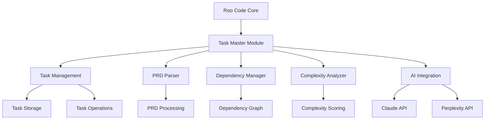
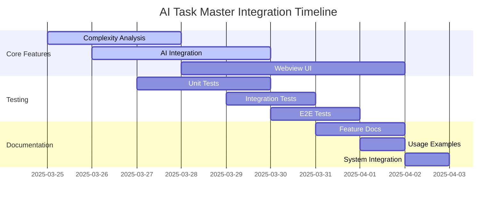

# AI Task Master Integration Plan for Roo Code

## Integration Architecture

## Implementation Status

1. ✅ **Create Task Master Module**
   - Add new module in Roo Code's src/integrations directory
   - Implement core task management functionality
   - Integrate with Roo Code's existing file and command tools

2. ✅ **Task Management System**
   - Create task storage using JSON format (tasks.json)
   - Implement CRUD operations for tasks
   - Add status tracking (pending, in-progress, done)
   - Support subtasks and task hierarchies

3. ✅ **PRD Parser**
   - Add PRD parsing capability
   - Convert PRD.txt into structured tasks
   - Generate initial task dependencies
   - Integrate with Roo Code's file system tools

4. ✅ **Dependency Management**
   - Implement dependency graph
   - Add validation for task dependencies
   - Provide visual representation of task dependencies
   - Integrate with Roo Code's webview UI

5. ⏳ **Complexity Analysis**
   - Add complexity scoring system (1-10)
   - Implement task expansion based on complexity
   - Generate detailed complexity reports
   - Integrate with Roo Code's reporting system

6. ⏳ **AI Integration**
   - Add Claude API integration
   - Add Perplexity API integration
   - Add OpenRouter API integration
   - Implement AI-driven task generation
   - Add research-backed subtask generation
   - Integrate with Roo Code's existing AI tools

7. ✅ **Command Interface**
   - Add CLI commands for task management
   - Integrate with Roo Code's command system
   - Add commands for:
     - Task generation
     - Task listing
     - Task completion
     - Dependency management
     - Complexity analysis

8. ⏳ **Webview UI**
   - Add task management interface
   - Visualize task dependencies
   - Show complexity analysis
   - Provide task status overview
   - Integrate with Roo Code's existing webview system

9. ⏳ **Testing**
   - Add unit tests for all new functionality
   - Add integration tests with Roo Code core
   - Add end-to-end tests for task workflows
   - Integrate with Roo Code's existing test framework

10. ⏳ **Documentation**
    - Add documentation for Task Master features
    - Update Roo Code's main documentation
    - Add examples and usage guides
    - Integrate with Roo Code's documentation system

## Updated Integration Plan

### 1. Complete In-Progress Items

**Complexity Analysis:**
- [ ] Implement scoring algorithm in `scripts/modules/task-manager.js`
- [ ] Add complexity report generation
- [ ] Integrate with task expansion system
- [ ] Add unit tests

**AI Integration:**
- [ ] Finalize Claude API integration
- [ ] Complete Perplexity API integration
- [ ] Add OpenRouter API support
- [ ] Implement research-backed subtask generation
- [ ] Add unit tests

**Webview UI:**
- [ ] Create task visualization component
- [ ] Implement dependency graph visualization
- [ ] Add complexity analysis display
- [ ] Create task status dashboard
- [ ] Add integration tests

**Testing:**
- [ ] Complete unit test coverage
- [ ] Finalize integration tests
- [ ] Complete end-to-end test scenarios
- [ ] Verify test framework integration

**Documentation:**
- [ ] Document all new features
- [ ] Update main documentation
- [ ] Create usage examples
- [ ] Finalize documentation system integration

### 2. Implementation Timeline

### 3. Next Steps

1. Complete complexity analysis implementation
2. Finalize AI service integrations
3. Develop webview UI components
4. Complete test coverage
5. Finalize documentation
6. Perform final integration testing
7. Update changelog with all changes