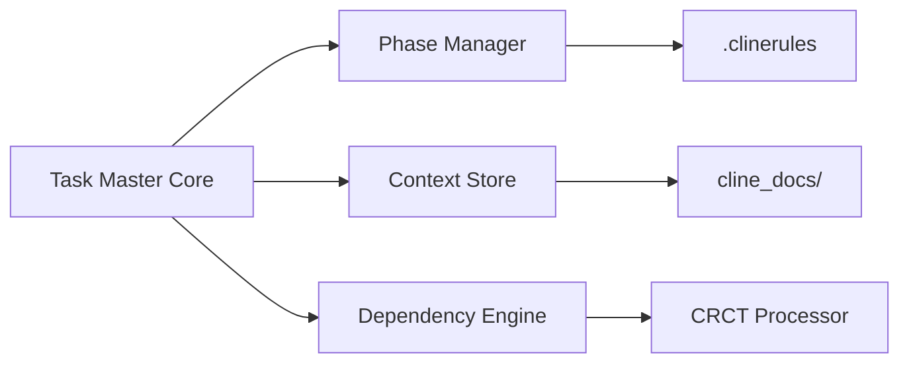

# CRCT Integration Plan

## 1. Core Features to Integrate
- **Phase Management**: Import .clinerules workflow system
- **Context Persistence**: Add cline_docs/ directory structure
- **Enhanced Dependency Tracking**: 
  - Hierarchical task dependencies
  - Visual dependency graphs
  - Automated dependency validation

## 2. Implementation Roadmap

### Phase 1: Architecture Updates


### Phase 2: CLI Command Additions
- `task-master phase [set|get]` - Manage workflow phases
- `task-master context [view|edit]` - Persistent context
- `task-master deps [visualize|validate]` - Enhanced dependencies

### Phase 3: File Structure Changes
```
/tasks/
  tasks.json
/cline_docs/
  activeContext.md
  changelog.md  
  dependency_tracker.md
.clinerules
```

## 3. Technical Specifications

**Dependency Engine Updates**:
- Support hierarchical IDs (1.2.3)
- Add circular dependency detection
- Implement CRCT's compression algorithm

**Context Store**:
- Auto-save task context
- Version history
- Cross-task references

## 4. Migration Plan
1. Add new files with CRCT templates
2. Create compatibility layer
3. Phase rollout with fallbacks
4. Full integration testing