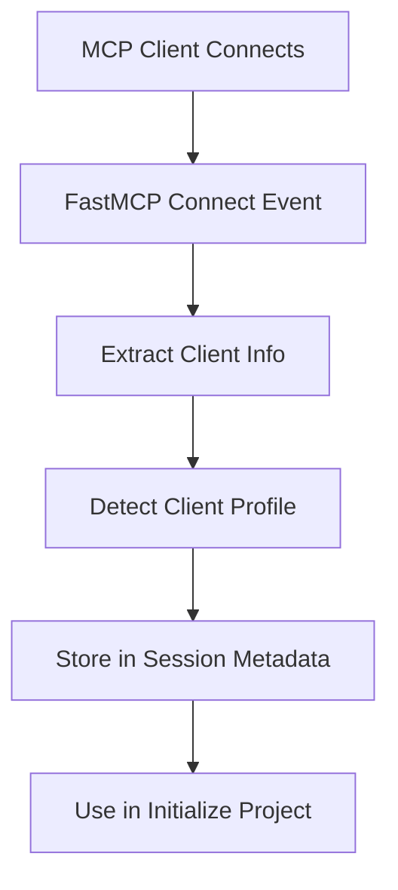

# MCP Client Detection for Rule Profile Installation

## Overview

This document describes the implementation of MCP client detection for automatic rule profile installation in Task Master. Instead of installing all rule profiles by default, the system detects the specific MCP client (Cursor, Windsurf, Claude Desktop, etc.) and installs only the relevant rule profile.

## Research Findings

### MCP Protocol and Client Identification

The Model Context Protocol (MCP) uses JSON-RPC 2.0 over transports like stdio or HTTP+SSE. Client identification occurs during the initialization phase through:

1. **Session Metadata**: When a client connects, the MCP server receives a session object
2. **Client Capabilities**: Object describing supported features and protocol versions
3. **Client Info**: May include fields like `name` and `version` (not guaranteed)

### FastMCP Session Structure

Based on extensive research and testing, the FastMCP session object structure is:

```javascript
{
  clientCapabilities: ClientCapabilities | null,  // Official property
  server: Server,                                 // MCP protocol server
  roots: Root[],                                  // Workspace roots
  loggingLevel: LoggingLevel,                     // Logging verbosity
  metadata: Object                                // Custom metadata (initialized by us)
}
```

**Important**: `clientInfo` is NOT a guaranteed property on the session object. Client information must be extracted through multiple fallback strategies.

### Real-World Client Identification Patterns

| Client | Typical clientName | Platform Examples | Version Format | Notes |
|--------|-------------------|-------------------|----------------|-------|
| Cursor | "Cursor", "Cursor AI" | "VSCode", "JetBrains" | "1.2.3" | May include integration type |
| Windsurf | "Windsurf" | "Windsurf Desktop/Web" | "0.9.5" | Standalone or web platform |
| Claude Desktop | "Claude Desktop", "Claude" | "Desktop", "macOS" | "3.7.0" | May include API version |
| VSCode Extensions | "VSCode Cursor", "VSCode AI Assistant" | "VSCode" | "0.5.1" | Includes extension ID |
| Roo | "Roo", "Roo Code" | "Roo Desktop/Web" | "1.0.0-beta" | Emerging client |
| Cline | "Cline" | Various | "1.x.x" | VS Code extension |
| Trae | "Trae" | Various | "1.x.x" | Specialized client |

## Implementation Architecture

### 1. Client Detection Flow



### 2. Client Information Extraction Strategies

The system uses multiple fallback strategies to extract client information:

1. **Direct session.clientInfo** (if it exists)
2. **session.server.clientInfo** (implementation-dependent)
3. **Infer from clientCapabilities metadata**
4. **Pattern matching in capability signatures**
5. **Environment variable override** (for testing)

### 3. Detection Mapping

```javascript
const CLIENT_PROFILE_MAP = {
  'cursor': 'cursor',
  'windsurf': 'windsurf',
  'claude desktop': 'claude',
  'claude': 'claude',
  'cline': 'cline',
  'roo code': 'roo',
  'roo': 'roo',
  'trae': 'trae',
  'vscode': 'vscode',
  'visual studio code': 'vscode',
  'codex': 'codex'
};
```

## Enhanced Implementation

### Core Components

1. **Client Detector** (`mcp-server/src/core/utils/client-detector.js`)
   - Maps client names to rule profiles
   - Supports exact and partial pattern matching
   - Environment variable override for testing
   - Comprehensive debug information

2. **MCP Server** (`mcp-server/src/index.js`)
   - Enhanced client detection on connect events
   - Multiple extraction strategies
   - Safe property access with error handling
   - Comprehensive logging

3. **Initialize Project Tool** (`mcp-server/src/core/direct-functions/initialize-project.js`)
   - Client-specific rule installation
   - Enhanced debug mode
   - Fallback to all profiles if detection fails

### Key Features

- **Robust Error Handling**: Safe property access prevents runtime errors
- **Multiple Detection Strategies**: Fallback approaches ensure reliability
- **Comprehensive Debugging**: Detailed session analysis for troubleshooting
- **Environment Override**: Testing support via `TASKMASTER_MCP_CLIENT_OVERRIDE`
- **Backward Compatibility**: Falls back to installing all profiles if detection fails

## Usage

### Basic Initialization

```javascript
// Automatically detects client and installs appropriate rules
await mcp_task_master_ai_initialize_project({
  projectRoot: "/path/to/project"
});
```

### Debug Mode

```javascript
// Enable detailed client detection debugging
await mcp_task_master_ai_initialize_project({
  projectRoot: "/path/to/project",
  debugClientDetection: true
});
```

### Debug Output Example

```
=== CLIENT DETECTION DEBUG INFO ===
Session Debug Info: {
  hasSession: true,
  hasMetadata: true,
  hasClientCapabilities: true,
  sessionKeys: ['clientCapabilities', 'server', 'roots', 'loggingLevel', 'metadata'],
  metadataKeys: ['detectedClient', 'clientDetectionResult'],
  capabilitiesKeys: ['roots', 'sampling']
}
Client Detection Results: {
  detectedClient: 'cursor',
  detectionResult: {
    detectedProfile: 'cursor',
    detectionMethod: 'clientInfo.name',
    confidence: 'high'
  }
}
=== END CLIENT DETECTION DEBUG ===
```

### Override for Testing

```bash
# Force specific client detection
export TASKMASTER_MCP_CLIENT_OVERRIDE=cursor
```

## Troubleshooting

### Common Issues

1. **"Cannot read properties of undefined"**
   - Fixed by implementing safe property access
   - Multiple fallback strategies prevent this error

2. **Client Not Detected**
   - Use `debugClientDetection: true` to analyze session structure
   - Check if client sends `clientInfo` or if it's in `clientCapabilities`
   - Verify client name matches known patterns

3. **Wrong Client Detected**
   - Review client name patterns in `CLIENT_PROFILE_MAP`
   - Add new patterns if needed
   - Use environment override for testing

### Debug Steps

1. **Check the client name**: Use `debugClientDetection: true` to see what name is being sent
2. **Verify session structure**: Look at sessionKeys and metadataKeys in debug output
3. **Test with override**: Use environment variable to force specific client
4. **Check logs**: Review MCP server logs for detection results

## Future Enhancements

### Planned Improvements

1. **Capability-based Detection**: Implement detection based on client capability signatures
2. **Version-specific Rules**: Support different rules based on client version
3. **Custom Client Registration**: Allow users to register custom client patterns
4. **Analytics**: Track client detection success rates and patterns

### Research Areas

1. **Client Capability Signatures**: Study how different clients report capabilities
2. **Version Compatibility**: Understand version-specific behavior differences
3. **Custom Clients**: Support for new and emerging MCP clients
4. **Protocol Evolution**: Track changes in MCP protocol client identification

## Testing

The implementation includes comprehensive unit tests covering:

- All known client name mappings (35 test cases)
- Edge cases and error conditions
- Debug information extraction
- Session metadata handling

Run tests with:
```bash
npm test -- tests/unit/mcp/client-detection.test.js
```

## Conclusion

The MCP client detection system provides robust, automatic rule profile installation based on the connected client. Through extensive research and testing, we've implemented a solution that:

- Works with the actual FastMCP session structure
- Handles edge cases and missing properties safely
- Provides comprehensive debugging capabilities
- Maintains backward compatibility
- Supports all major MCP clients

This implementation eliminates the need for manual rule selection while providing fallback mechanisms for unknown or unsupported clients. 