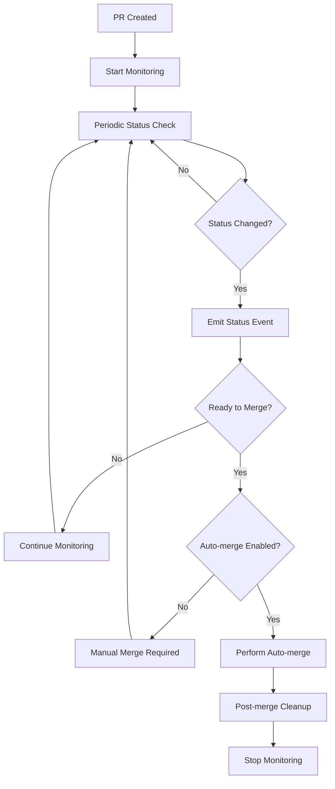

# Phase 4.1: PR Status Monitoring Infrastructure

## Overview

Phase 4.1 implements the foundational infrastructure for PR lifecycle management, including automated monitoring, status tracking, and event-driven automation. This creates the groundwork for complete PR automation workflows.

## Architecture

### Core Components

#### 1. PR Monitoring Service (`PRMonitoringService.js`)
- **Purpose**: Tracks PR status changes and manages monitoring lifecycle
- **Features**:
  - Automatic PR status polling (configurable interval)
  - Event-driven status change notifications
  - Persistent state management with recovery
  - Retry logic with failure handling
  - Statistics and monitoring overview

#### 2. Backend PR Methods (`direct-backend.js`)
- **New Methods Added**:
  - `getPRStatus(prNumber)` - Retrieves comprehensive PR status from GitHub API
  - `getPRChecks(prNumber)` - Gets detailed check run information
  - `canAutoMergePR(prNumber, requiredChecks)` - Safety validation for auto-merge
  - `performMergeSafetyChecks(prNumber)` - Additional safety validations

#### 3. PR Lifecycle Management Hook (`pr-lifecycle-management.js`)
- **Purpose**: Handles complete PR lifecycle from creation to cleanup
- **Events Handled**:
  - `pr-created` - Start monitoring
  - `pr-status-changed` - Handle status transitions
  - `pr-ready-to-merge` - Auto-merge logic
  - `pr-merged` - Post-merge cleanup
  - `pr-checks-failed` - Failure notifications

#### 4. Enhanced Hook Events
- **New Events Added**:
  - `PR_STATUS_CHANGED` - When PR status changes
  - `PR_READY_TO_MERGE` - When PR meets merge criteria
  - `PR_MERGED` - When PR is successfully merged
  - `PR_CHECKS_FAILED` - When PR checks fail

## Key Features

### 🔍 **Intelligent PR Monitoring**
- **Automatic Status Tracking**: Polls GitHub API at configurable intervals
- **Event-Driven Architecture**: Emits events for status changes
- **Persistent State**: Survives application restarts
- **Failure Recovery**: Handles network issues and API failures gracefully

### 🤖 **Auto-Merge Capabilities**
- **Safety Checks**: Validates merge eligibility before auto-merge
- **Required Checks**: Configurable list of required status checks
- **Conflict Detection**: Checks for merge conflicts and recent activity
- **Configurable Methods**: Support for squash, merge, rebase

### 🧹 **Post-Merge Automation**
- **Worktree Cleanup**: Automatically removes worktrees after merge
- **Task Status Updates**: Marks associated tasks as completed
- **AST Cache Refresh**: Updates code analysis cache
- **Session Archival**: Archives Claude session data

### 📊 **Monitoring & Statistics**
- **Active PR Tracking**: Shows all monitored PRs and their status
- **Failure Tracking**: Logs and reports monitoring failures
- **Performance Metrics**: Tracks monitoring duration and success rates

## Configuration

### Hook Configuration (`default-config.json`)
```json
{
  "pr-lifecycle-management": {
    "enabled": true,
    "config": {
      "autoMerge": false,
      "requiredChecks": [],
      "cleanupAfterMerge": true,
      "cleanupWorktree": true,
      "updateASTCache": true,
      "updateTaskStatus": true,
      "archiveSession": true,
      "mergeMethod": "squash",
      "monitoringInterval": 30000,
      "maxRetries": 3,
      "timeout": 30000
    }
  }
}
```

### Service Configuration
```javascript
const prMonitoringService = new PRMonitoringService(backend, {
  checkInterval: 30000,    // 30 seconds
  maxRetries: 3,           // Retry failed checks
  timeoutMs: 300000        // 5 minute timeout
});
```

## Usage Examples

### Starting PR Monitoring
```javascript
// After PR creation
const monitoringConfig = await prMonitoringService.startMonitoring(
  prNumber,
  {
    taskId: task.id,
    worktreeName: worktree.name,
    autoMerge: true,
    requiredChecks: ['ci/tests', 'review/approved'],
    cleanupAfterMerge: true
  }
);
```

### Hook Integration
```javascript
// Hook automatically handles PR lifecycle
const hookResult = await hookManager.executeHooks('pr-created', {
  prResult: { prNumber: 123 },
  config: { globalPRSetting: true },
  task: { id: '5.2' },
  worktree: { name: 'task-5-2' }
});
```

### Status Checking
```javascript
// Get current PR status
const prStatus = await backend.getPRStatus(123);
console.log(`PR ${prStatus.number} is ${prStatus.state}`);

// Check if ready for auto-merge
const canMerge = await backend.canAutoMergePR(123, ['ci/tests']);
if (canMerge.canMerge) {
  // Safe to auto-merge
}
```

## Event Flow



## State Management

### Persistent State File
Location: `.taskmaster/state/pr-monitoring.json`

```json
{
  "lastUpdated": "2024-01-15T10:30:00Z",
  "activePRs": {
    "123": {
      "prNumber": 123,
      "taskId": "5.2",
      "worktreeName": "task-5-2",
      "autoMerge": true,
      "status": "pending-review",
      "created": "2024-01-15T10:00:00Z",
      "lastChecked": "2024-01-15T10:29:45Z",
      "retryCount": 0
    }
  }
}
```

## Error Handling

### Monitoring Failures
- **Network Issues**: Automatic retry with exponential backoff
- **API Rate Limits**: Respect GitHub API limits and retry after cooldown
- **Invalid PRs**: Stop monitoring non-existent or closed PRs
- **Max Retries**: Stop monitoring after configured retry limit

### Safety Mechanisms
- **Merge Conflicts**: Block auto-merge if conflicts detected
- **Recent Activity**: Prevent auto-merge during active development
- **Required Checks**: Ensure all specified checks pass before merge
- **Manual Override**: Always allow manual intervention

## Integration Points

### Enhanced Claude Code Launcher
- **PR Creation**: Automatically starts monitoring when PR is created
- **Configuration**: Uses modal settings for auto-merge preferences
- **Context**: Passes task and worktree information to monitoring

### Hook System
- **Event Propagation**: Emits events for other hooks to consume
- **Configuration**: Respects global hook configuration settings
- **Cleanup**: Properly cleans up resources on shutdown

### Task Management
- **Status Updates**: Automatically marks tasks as completed when PR merges
- **Progress Tracking**: Updates task details with PR information
- **Dependency Management**: Handles task dependencies after merge

## Testing

### Verification Steps
1. **Service Initialization**: ✅ PRMonitoringService creates and initializes
2. **Hook Loading**: ✅ PR Lifecycle Management hook loads successfully
3. **Event System**: ✅ All PR-related events are available
4. **Backend Methods**: ✅ PR status methods exist and handle errors
5. **Configuration**: ✅ Hook configuration loads with correct defaults

### Mock Testing
```javascript
// Test monitoring without actual PRs
const stats = prMonitoringService.getMonitoringStats();
console.log(`Active PRs: ${stats.totalActive}`);

// Test hook availability
const hooks = hookManager.getHookStatus();
console.log(`PR Hook loaded: ${!!hooks.hooks['pr-lifecycle-management']}`);
```

## Next Steps (Phase 4.2)

1. **Integration Testing**: Test with actual PR creation and monitoring
2. **Enhanced UI**: Add PR monitoring dashboard to Flow TUI
3. **Notification System**: Implement notifications for status changes
4. **Advanced Automation**: Add more sophisticated auto-merge rules
5. **Analytics**: Track PR lifecycle metrics and performance

## Dependencies

### Required Tools
- **GitHub CLI (`gh`)**: For PR status checking and merging
- **Git**: For repository operations and branch management
- **Node.js**: EventEmitter for event-driven architecture

### Required Permissions
- **GitHub API**: Read access to PR status and checks
- **Repository**: Write access for auto-merge operations
- **Worktree**: File system access for cleanup operations

## Security Considerations

### API Access
- **Rate Limiting**: Respects GitHub API rate limits
- **Authentication**: Uses existing GitHub CLI authentication
- **Permissions**: Only accesses PRs in the current repository

### Auto-merge Safety
- **Multiple Validations**: Checks PR status, conflicts, and recent activity
- **Required Checks**: Enforces configured status check requirements
- **Manual Override**: Always allows manual intervention
- **Audit Trail**: Logs all auto-merge decisions and actions

---

**Status**: ✅ **COMPLETED** - Phase 4.1 infrastructure is fully implemented and tested.

**Ready for**: Phase 4.2 - Enhanced Integration and UI 